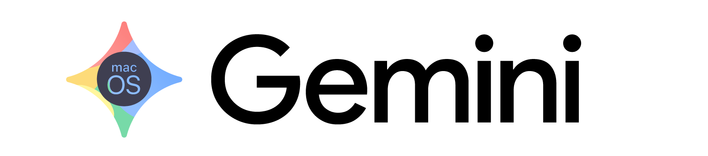

# Gemini Desktop for Intel Macs



A lightweight, native-feeling desktop wrapper for Google Gemini, **purpose-built for Intel-based (pre M-series) Apple Macs** running macOS 13 or later. The official Gemini desktop experience targets Apple Silicon, leaving otherwise capable Intel hardware without a first-class option — this project fills that gap.

An `arm64` build is produced for completeness, but the primary target is `darwin-x64`.

## Why this exists

Google's native desktop offering does not extend to Intel Macs. Rather than living in yet another browser tab, this project gives Intel-Mac users a proper standalone application: a dock icon, a persistent session, native context menus, and OS-level file dialogs — all the small things that make a wrapper feel like an app rather than a tab in disguise.

## Features

- **Persistent asset cache** — the webview runs in a `persist:gemini` partition, so Chromium's disk cache is shared across launches and cold starts are noticeably quicker.
- **Polished load behaviour** — the webview is opacity-hidden until `did-stop-loading` fires, so content appears in one piece rather than flashing through incremental render stages.
- **Responsive layout** — the webview is absolutely positioned (`inset: 0`) to fill the window; Gemini's own responsive CSS handles the rest, so resizing is fluid at any window size.
- **Frictionless downloads** — files save straight to `~/Downloads/` via `session.on('will-download')`, with no save-dialog interruption.
- **Native Copy / Paste menu** — `context-menu` events are forwarded over IPC and rendered as a native `Menu.buildFromTemplate`, calling `webview.copy()` / `webview.paste()`.
- **Clipboard API support** — `setPermissionRequestHandler` grants all permissions, including `clipboard-read` and `clipboard-write`, so paste-from-clipboard works inside Gemini.
- **Unrestricted file uploads** — a `MutationObserver` injected on `dom-ready` strips `accept` restrictions and adds the `multiple` attribute to every `<input type="file">`, triggering the standard macOS file-open sheet.
- **Google OAuth popups** — `allowpopups="true"` combined with `setWindowOpenHandler` lets sign-in popups through, while routing other external URLs to the default browser.

## Tech stack

- **Electron 33** — desktop runtime
- **React 18 + TypeScript** — renderer UI
- **electron-vite** — development and build tooling
- **electron-builder** — DMG packaging (x64 + arm64, minimum macOS 13)

## Project structure

```
src/
├── main/
│   └── index.ts            # Main process: window, session, menus, IPC
├── preload/
│   └── index.ts            # Context bridge — exposes electronAPI to renderer
└── renderer/
    └── src/
        ├── App.tsx         # React component wrapping the <webview>
        └── App.css         # Loader overlay + full-window webview layout

resources/
└── icon.icns               # macOS app icon

build/
└── entitlements.mac.plist  # Hardened-runtime entitlements

electron-builder.yml        # Build targets: DMG × x64 + arm64
```

## Development

```bash
# Install dependencies
npm install

# Run in development
npm run dev

# Build a DMG
npm run build:mac
```

## Build targets

`electron-builder.yml` produces DMGs for both `x64` and `arm64`, with a minimum supported macOS version of 13 (Ventura). The Intel build is the headline artefact; the Apple Silicon build is included for users on mixed hardware or anyone who simply prefers a wrapper to a browser tab.

## Notes

- This is an unofficial wrapper and is not affiliated with Google.
- Authentication runs through Google's standard OAuth flow — credentials are never handled by the app itself.
